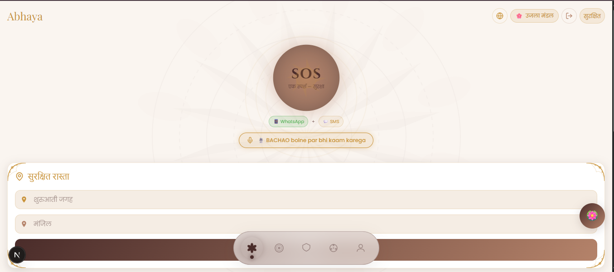
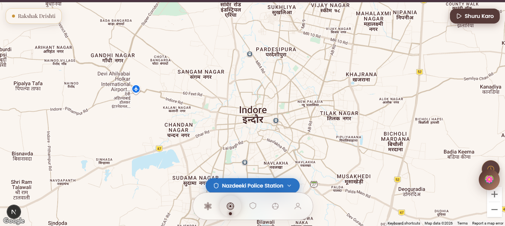
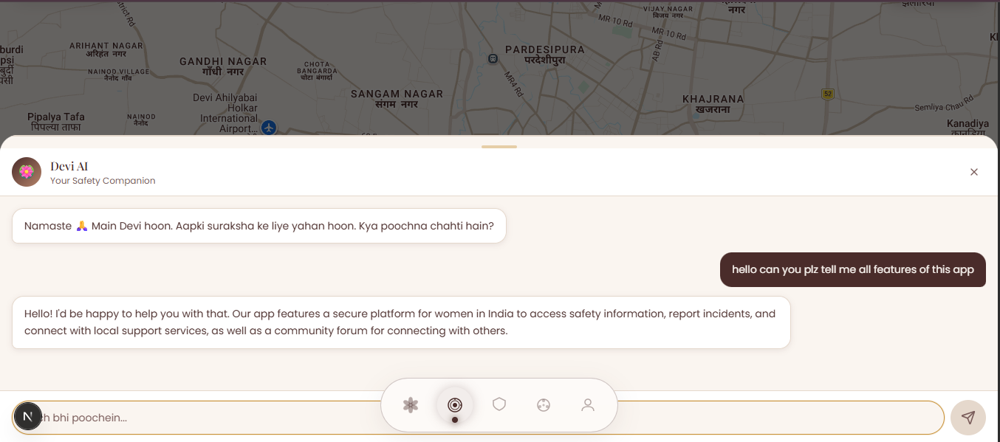
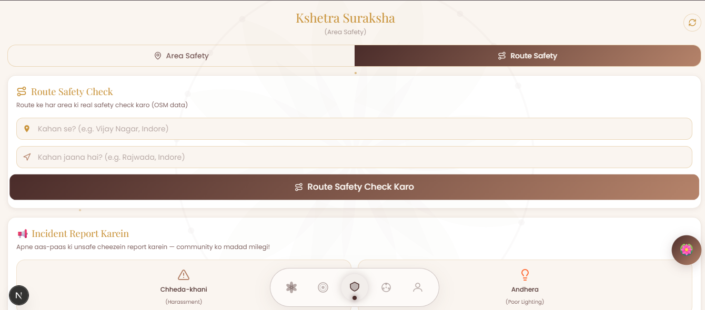

# 🪷 Abhaya — Be Fearless, Be Safe

> **India's first AI-powered women's safety platform with Indian Mandala aesthetics**


---

## 📱 What is Abhaya?

**Abhaya** (Sanskrit: अभया — "Fearless") is a comprehensive women's safety mobile-first web application. It combines AI, real-time location tracking, emergency alerts, and community-driven safety data — all wrapped in a beautiful Indian Mandala art aesthetic inspired by Rajasthani miniature paintings.

> 🏆 Built for **OSEN VIBECODE Hackathon 2025**

> 🎨 **UI designed using [v0.dev](https://v0.dev) by Vercel** — AI-powered frontend builder

---

## 📸 Screenshots

| Home — SOS + Routes | Live Tracking Map |
|---|---|
|  |  |

| Devi AI Chatbot | Safety Screen |
|---|---|
|  |  |

---

## ✨ Features

### 🚨 SOS & Emergency
| Feature | Status | Description |
|---|---|---|
| SOS Button | ✅ Working | 5-second countdown + Supabase save + WhatsApp alert |
| Voice SOS | 🎤 UI Ready | Say "BACHAO" to trigger SOS |
| 112 Call | ✅ Working | One-tap police call after SOS |
| Fake Call | ✅ Working | Simulated incoming call from "Papa" |
| SMS Alert | ✅ Working | Fast2SMS alert to all trusted contacts |

### 📍 Live Location & Tracking
| Feature | Status | Description |
|---|---|---|
| Live GPS Tracking | ✅ Working | Real-time location saved to Supabase |
| Location Share | ✅ Working | WhatsApp link to all contacts |
| Journey Timer | 🎨 UI Ready | Auto-alert if not checked in |
| Google Maps | ✅ Working | Full screen real map with Hindi labels |
| Nearby Police | ✅ Working | Real stations via OpenStreetMap |

### 🗺️ Maps & Navigation
| Feature | Status | Description |
|---|---|---|
| Safe Route Finder | ✅ Working | 3 real routes via OpenRouteService API |
| Route Colors | ✅ Working | Green (Safe) / Gold (Fast) / Purple (Lit) |
| Safety Score | ✅ Working | AI safety rating per route |
| Route Safety Check | ✅ Working | OSM data based area safety |

### 🤖 Devi AI Chatbot
| Feature | Status | Description |
|---|---|---|
| Devi AI | ✅ Working | Powered by Groq (Llama 3.1 8B) |
| Hindi/English | ✅ Working | Auto-detects language |
| Safety Advice | ✅ Working | Emergency guidance + 112 reminders |

### 🛡️ Safety Screen
| Feature | Status | Description |
|---|---|---|
| Area Safety Score | 🎨 UI Ready | Score ring with factors |
| Safety Heatmap | 🎨 UI Ready | Safe/Danger zone visualization |
| Incident Reporting | ✅ Working | Save to Supabase with location |
| Route Safety Check | ✅ Working | Real safety analysis per route |

### 👨‍👩‍👧 SafeCircle
| Feature | Status | Description |
|---|---|---|
| Family Circle | ✅ Working | Real contacts from Supabase |
| Add Members | ✅ Working | Name, phone, relation save |
| Live Link Share | ✅ Working | Share location link to all |

### 🔐 Authentication
| Feature | Status | Description |
|---|---|---|
| Email OTP Login | ✅ Working | Passwordless via Supabase + Gmail SMTP |
| Guest Access | ✅ Working | No login required |
| Profile Management | ✅ Working | Name, phone, contacts |

### 🎨 UI & Design
| Feature | Status | Description |
|---|---|---|
| Indian Mandala Theme | ✅ Working | Lotus, rangoli, mandala motifs |
| Mocha Rose Theme | ✅ Working | Cream + chocolate + rose gold |
| Dark Mandala Theme | ✅ Working | Deep navy + gold |
| Theme Switcher | ✅ Working | Multiple themes |
| 8 Indian Languages | ✅ Working | Hindi, Tamil, Telugu, Bengali + more |
| Framer Motion | ✅ Working | Smooth animations throughout |

---

## 🛠️ Tech Stack

```
UI Design     → v0.dev (AI-powered frontend builder by Vercel)
Frontend      → Next.js 16 + TypeScript + Tailwind CSS
Animation     → Framer Motion
Backend       → Supabase (Auth + PostgreSQL + Realtime)
AI Chatbot    → Groq API (Llama 3.1 8B Instant)
Maps          → Google Maps JavaScript API
Routing       → OpenRouteService API
Geocoding     → OpenRouteService Geocoding
POI Data      → OpenStreetMap Overpass API
SMS Alerts    → Fast2SMS API
Auth Email    → Gmail SMTP (custom)
Deployment    → Vercel
```

---

## 🚀 Getting Started

### Prerequisites
- **Node.js** v18+ → [nodejs.org](https://nodejs.org)
- **pnpm** → `npm install -g pnpm`
- **Git** → [git-scm.com](https://git-scm.com)

### 1️⃣ Clone the Repository
```bash
git clone https://github.com/your-username/abhaya-app.git
cd abhaya-app
```

### 2️⃣ Install Dependencies
```bash
pnpm install
```

### 3️⃣ Setup Environment Variables
Create `.env.local` file in root:
```env
# Supabase
NEXT_PUBLIC_SUPABASE_URL=your_supabase_project_url
NEXT_PUBLIC_SUPABASE_ANON_KEY=your_supabase_anon_key

# Groq AI (Devi chatbot)
GROQ_API_KEY=your_groq_api_key

# OpenRouteService (maps & routes)
NEXT_PUBLIC_ORS_API_KEY=your_ors_api_key

# Fast2SMS (SMS alerts)
FAST2SMS_API_KEY=your_fast2sms_api_key
```

### 4️⃣ Setup Supabase Database
Go to Supabase → SQL Editor → Run:
```sql
CREATE TABLE profiles (
  id UUID REFERENCES auth.users PRIMARY KEY,
  name TEXT, phone TEXT,
  created_at TIMESTAMP DEFAULT NOW()
);
CREATE TABLE contacts (
  id UUID DEFAULT gen_random_uuid() PRIMARY KEY,
  user_id UUID REFERENCES profiles(id) ON DELETE CASCADE,
  name TEXT NOT NULL, phone TEXT NOT NULL, relation TEXT,
  created_at TIMESTAMP DEFAULT NOW()
);
CREATE TABLE locations (
  id UUID DEFAULT gen_random_uuid() PRIMARY KEY,
  user_id UUID REFERENCES profiles(id) ON DELETE CASCADE,
  latitude FLOAT NOT NULL, longitude FLOAT NOT NULL,
  is_tracking BOOLEAN DEFAULT false,
  updated_at TIMESTAMP DEFAULT NOW()
);
CREATE TABLE sos_alerts (
  id UUID DEFAULT gen_random_uuid() PRIMARY KEY,
  user_id UUID REFERENCES profiles(id) ON DELETE CASCADE,
  latitude FLOAT, longitude FLOAT,
  message TEXT DEFAULT 'SOS! I need help!',
  sent_at TIMESTAMP DEFAULT NOW()
);
CREATE TABLE incidents (
  id UUID DEFAULT gen_random_uuid() PRIMARY KEY,
  user_id UUID REFERENCES profiles(id),
  type TEXT NOT NULL, latitude FLOAT, longitude FLOAT,
  description TEXT, reported_at TIMESTAMP DEFAULT NOW()
);
CREATE TABLE safe_spots (
  id UUID DEFAULT gen_random_uuid() PRIMARY KEY,
  name TEXT NOT NULL, type TEXT,
  latitude FLOAT, longitude FLOAT,
  added_by UUID REFERENCES profiles(id)
);

-- Row Level Security
ALTER TABLE profiles ENABLE ROW LEVEL SECURITY;
ALTER TABLE contacts ENABLE ROW LEVEL SECURITY;
ALTER TABLE locations ENABLE ROW LEVEL SECURITY;
ALTER TABLE sos_alerts ENABLE ROW LEVEL SECURITY;
ALTER TABLE incidents ENABLE ROW LEVEL SECURITY;
ALTER TABLE safe_spots ENABLE ROW LEVEL SECURITY;

CREATE POLICY "Own profile" ON profiles FOR ALL USING (auth.uid() = id);
CREATE POLICY "Own contacts" ON contacts FOR ALL USING (auth.uid() = user_id);
CREATE POLICY "Own location" ON locations FOR ALL USING (auth.uid() = user_id);
CREATE POLICY "Own SOS" ON sos_alerts FOR ALL USING (auth.uid() = user_id);
CREATE POLICY "Own incidents" ON incidents FOR ALL USING (auth.uid() = user_id);
CREATE POLICY "Anyone view spots" ON safe_spots FOR SELECT USING (true);
CREATE POLICY "Auth add spots" ON safe_spots FOR INSERT WITH CHECK (auth.uid() = added_by);
```

### 5️⃣ Setup Supabase Auth
```
Supabase Dashboard → Authentication → Providers
→ Enable Email provider
→ Turn OFF "Confirm email" (testing ke liye)
→ Auth → Email Templates → Custom SMTP setup karo
```

### 6️⃣ Get API Keys

**Groq API (Free)**
```
1. console.groq.com → Sign up
2. API Keys → Create key
3. .env.local mein add karo
```

**OpenRouteService (Free)**
```
1. openrouteservice.org → Sign up
2. Dashboard → Request a token
3. .env.local mein add karo
```

**Fast2SMS (Free tier)**
```
1. fast2sms.com → Sign up
2. Dev API → API key copy karo
3. .env.local mein add karo
```

### 7️⃣ Run Development Server
```bash
pnpm run dev
```
Open [http://localhost:3000](http://localhost:3000) 🎉

---

## 📁 Project Structure
```
abhaya-app/
├── app/
│   ├── api/
│   │   ├── chat/route.ts       # Devi AI (Groq)
│   │   └── sms/route.ts        # SMS alerts (Fast2SMS)
│   ├── globals.css             # Global styles + Mocha Rose theme
│   ├── layout.tsx              # Root layout
│   └── page.tsx                # Main app entry
├── components/
│   ├── screens/
│   │   ├── home-screen.tsx     # SOS + Route finder
│   │   ├── track-screen.tsx    # Live tracking + Map
│   │   ├── safety-screen.tsx   # Safety score + Reports
│   │   ├── circle-screen.tsx   # SafeCircle family
│   │   └── profile-screen.tsx  # Profile + Settings
│   ├── bottom-navigation.tsx   # Floating pill nav
│   ├── devi-chatbot.tsx        # AI chatbot UI
│   ├── language-context.tsx    # 8 language support
│   ├── loading-screen.tsx      # Mandala loading animation
│   ├── mandala-background.tsx  # Background mandala SVG
│   └── theme-context.tsx       # Theme management
├── lib/
│   ├── auth.ts                 # All Supabase functions
│   └── supabase.ts             # Supabase client
└── .env.local                  # Environment variables (git ignored)
```

---

## 🌐 Deployment (Vercel)

```bash
# Step 1 — Push to GitHub
git add .
git commit -m "Abhaya app - production ready"
git push origin main

# Step 2 — Vercel pe jao
# vercel.com → Import GitHub repo
# Environment Variables add karo
# Deploy!
```

**Vercel Environment Variables:**
```
NEXT_PUBLIC_SUPABASE_URL
NEXT_PUBLIC_SUPABASE_ANON_KEY
GROQ_API_KEY
NEXT_PUBLIC_ORS_API_KEY
FAST2SMS_API_KEY
```

---

## 🎨 Design System

```
Colors:
  Primary:    #4a2c2a  (Deep Mocha Brown)
  Secondary:  #b5836a  (Rose Gold)
  Accent:     #c9933a  (Antique Gold)
  Background: #faf5f0  (Warm Cream)

Fonts:
  Display:  Playfair Display
  Classic:  Cinzel
  Body:     Poppins

Motifs: 🪷 Lotus  ✦ Gold diamonds  🔮 Mandala
```

---

## 🌍 Supported Languages

| Language | SOS Word | Language | SOS Word |
|---|---|---|---|
| Hindi 🇮🇳 | बचाओ | Tamil 🇮🇳 | உதவி |
| English 🇬🇧 | HELP | Telugu 🇮🇳 | సహాయం |
| Bengali 🇮🇳 | বাঁচাও | Marathi 🇮🇳 | वाचवा |
| Gujarati 🇮🇳 | બચાવો | Kannada 🇮🇳 | ಸಹಾಯ |

---

## 🔒 Security
- ✅ Row Level Security (RLS) on all Supabase tables
- ✅ API keys in environment variables only
- ✅ `.env.local` in `.gitignore`
- ✅ Supabase Auth for user management

---

## 👩‍💻 Made By

**Sakshi Hanwat**
> 🎨 UI built with [v0.dev](https://v0.dev) — AI-powered frontend builder by Vercel

---

## 🏆 Hackathon

Built for **OSEN VIBECODE Hackathon 2025**
- Category: AI-Integrated Full-Stack Application
- Impact: Women's Safety across India

---

<div align="center">
  <strong>🪷 Abhaya — Har ladki ko darr ke nahi, himmat se jeena chahiye 🪷</strong>
</div>
